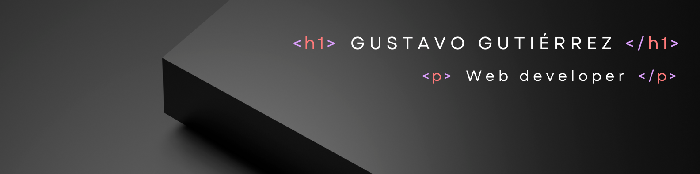

## Software Engineer

🔭 Currently working at developing the VFRI (Victoria Falls - Regional Institute) website. I work with great people and we are using great technologies! 

Long story short:

🥑 Eat 💻 Code 💪🏽 Train ♻️ Repeat

🌎 Check my [portfolio](https://portfoliogustavog.netlify.app)

I'm always doing some side projects, but I can't be bothered to keep my portfolio up to date. This is the first version of ny portfolio.

Feel free to reach out 💬

    <h2 align="center">Connect with me</h2>

